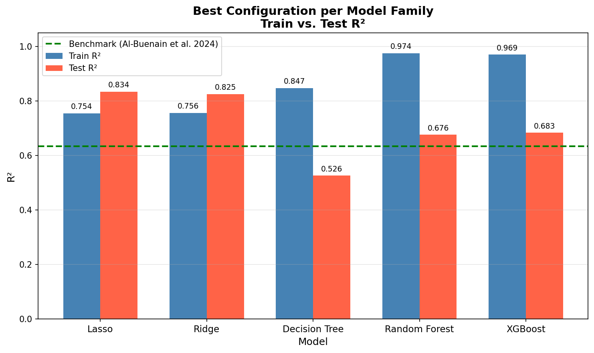
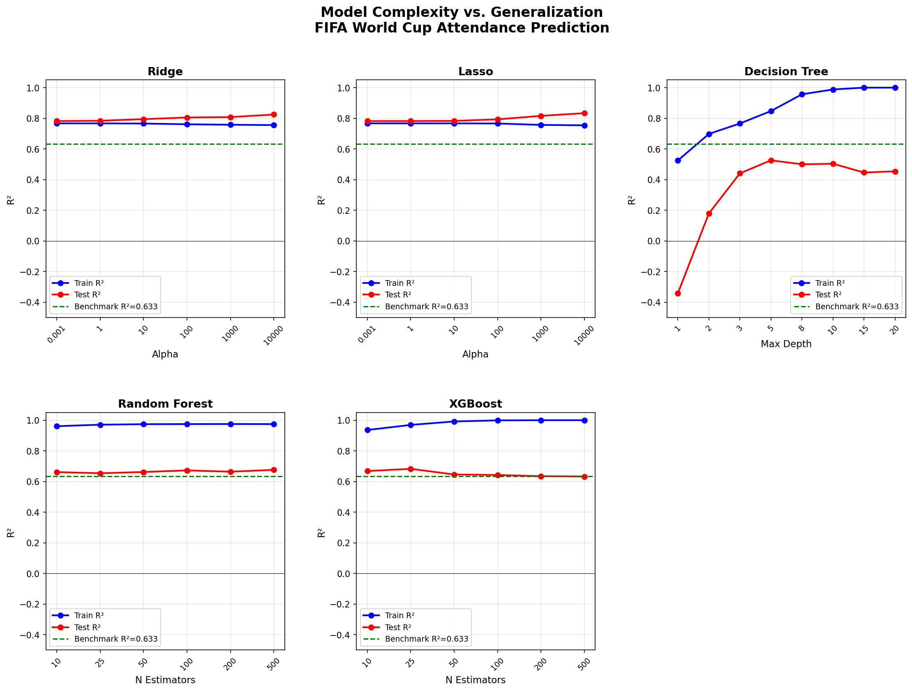
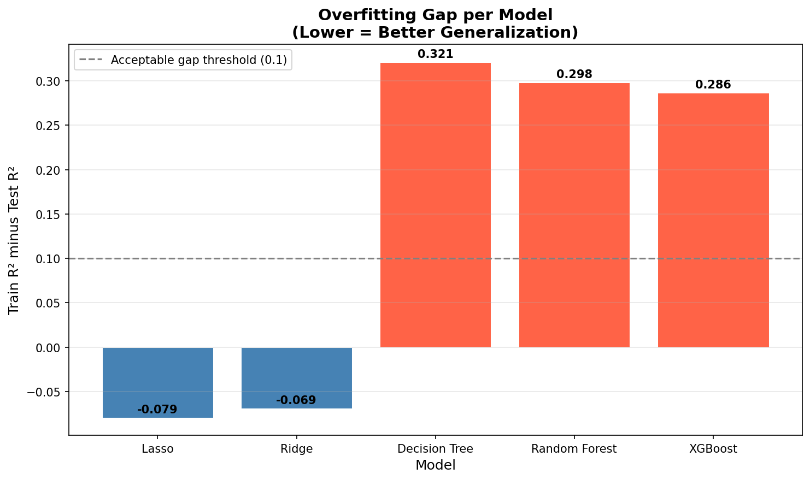
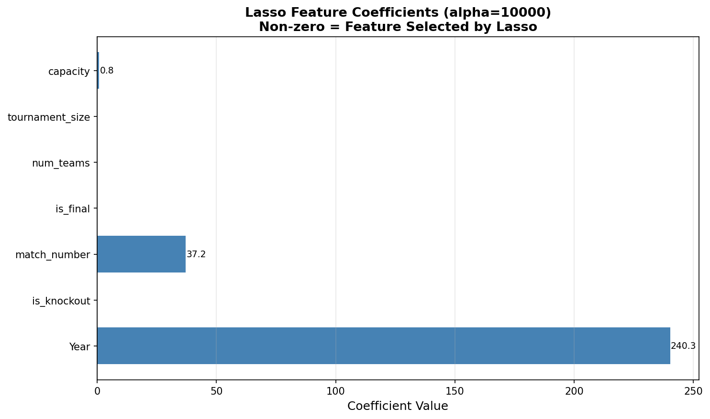
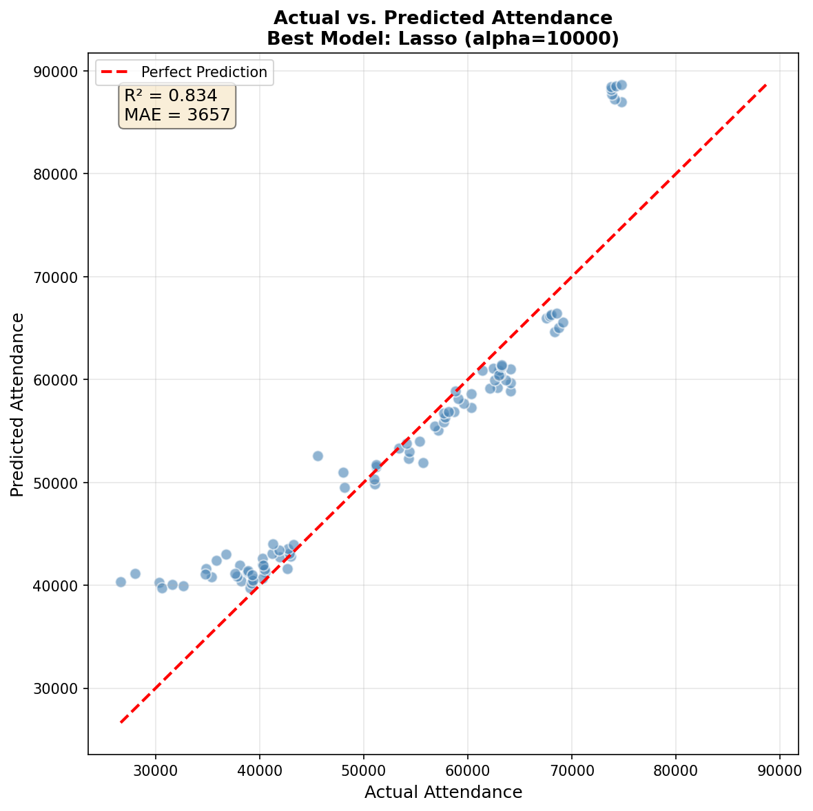
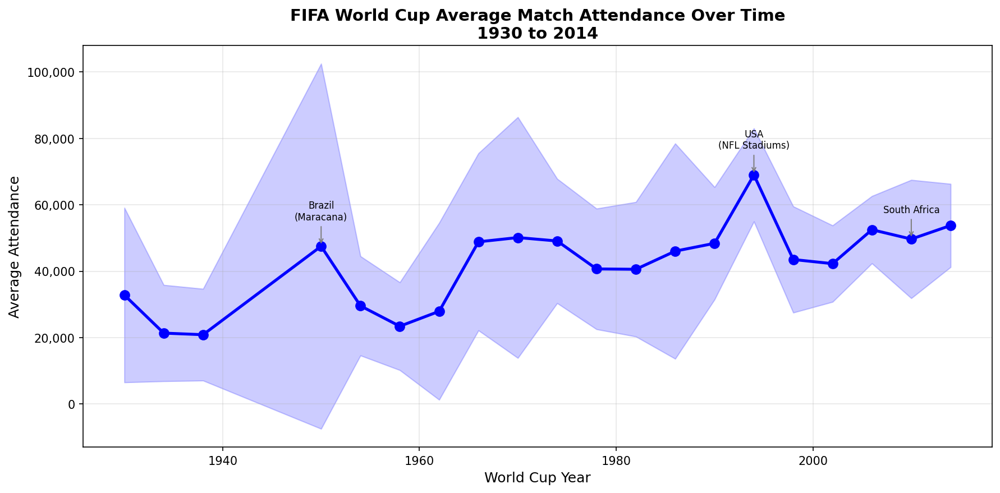

# Model Complexity and Generalization in FIFA World Cup Attendance Prediction

Does increasing model complexity improve attendance prediction, or do simpler models generalize better?

This project tests 5 machine learning model families on 900+ FIFA World Cup matches (1930-2014), varying a capacity parameter within each model to measure the tradeoff between complexity and generalization.

## Key Finding

Lasso regression, one of the simplest models tested, achieved the highest test R-squared of **0.834** using only 3 features (Year, match_number, stadium capacity). It outperformed Random Forest (0.676), XGBoost (0.683), and the closest published benchmark of 0.633 from Al-Buenain et al. (2024).

The complex models scored near-perfect on training data but overfit significantly on unseen tournaments.



## Results

| Model | Best Test R-squared | Capacity Knob | Best Setting | Overfitting Gap |
|-------|------------|---------------|--------------|-----------------|
| Lasso | **0.834** | alpha | 10,000 | -0.079 |
| Ridge | 0.825 | alpha | 10,000 | -0.069 |
| XGBoost | 0.683 | n_estimators | 25 | 0.286 |
| Random Forest | 0.676 | n_estimators | 500 | 0.298 |
| Decision Tree | 0.526 | max_depth | 5 | 0.321 |

## Figures

| Complexity Curves | Overfitting Gap |
|---|---|
|  |  |

| Feature Importance | Actual vs Predicted |
|---|---|
|  |  |



## Project Structure

```
Sports-Attendance-Predictor/
    main.py                     # Run the full pipeline
    src/
        features.py             # Data loading, cleaning, feature engineering
        models.py               # Time-aware split, model training, complexity curves
        stadium_capacity.py     # Stadium capacity lookup (Wikipedia)
        visualize.py            # All matplotlib figures
        evaluate.py             # Evaluation metrics
    data/
        WorldCupMatches.csv     # Match-level data
        WorldCups.csv           # Tournament-level data
    results/                    # Generated figures
```

## Methodology

**Data:** 673 matches with complete features from 20 FIFA World Cups (1930-2014). Stadium capacities were manually matched from Wikipedia for ~80% of matches.

**Train/Test Split:** Time-aware split. Trained on 1930-2006 (583 matches), tested on 2010-2014 (90 matches). No future data leaks into training.

**Experimental Design:** Each model family has one capacity parameter varied across a range:
- Ridge/Lasso: alpha in [0.001, 1, 10, 100, 1000, 10000]
- Decision Tree: max_depth in [1, 2, 3, 5, 8, 10, 15, 20]
- Random Forest/XGBoost: n_estimators in [10, 25, 50, 100, 200, 500]

**Metrics:** R-squared, MAE, RMSE

## How to Run

```bash
pip install pandas numpy scikit-learn xgboost matplotlib
python main.py
```

All figures are saved to the `results/` folder.

## References

- Al-Buenain, A., Haouari, M., & Jacob, J. R. (2024). Predicting fan attendance at mega sports events: A case study of the FIFA World Cup Qatar 2022. *Mathematics*, 12(6), 926.
- Pang, Y. (2025). Sports attendance prediction using LSTM and GRU with SHAP explainability. *Physical Culture and Sport. Studies and Research*, 111, 25-35.
- Maennig, W., & Mueller, S. Q. (2023). Game outcome uncertainty revisited: A clustering analysis of team-specific game attendance predictions. *Applied Economics*, 55(30), 3484-3498.

## Author

Aryan Anand, Purdue University, Industrial Engineering

Presented at the Purdue Undergraduate Research Symposium, April 2026.
